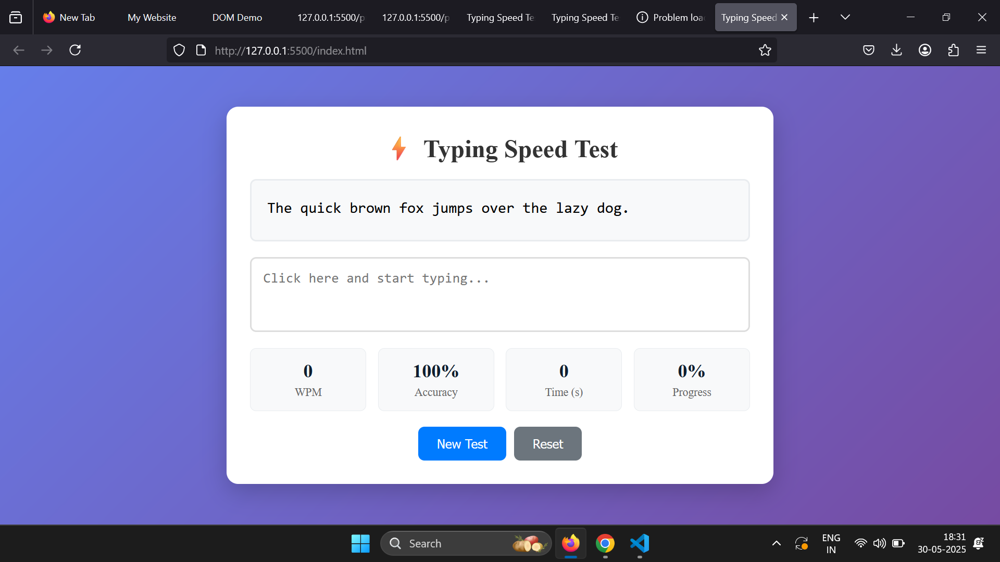

<!DOCTYPE html>
<html lang="en">
<head>
  <meta charset="UTF-8">
  <meta name="viewport" content="width=device-width, initial-scale=1">
  <title>Typing Speed Calculator - README</title>
  
</head>
<body>

  <h1>⌨️ Typing Speed Calculator</h1>
  
A simple and responsive web application that lets users test and improve their typing speed and accuracy in real time.

  <h2>🚀 Features</h2>
  <ul>
    <li>Real-time typing speed calculation (Words Per Minute)</li>
    <li>Accuracy tracking</li>
    <li>Timer functionality</li>
    <li>Clean and responsive UI</li>
    <li>Built with <strong>HTML</strong>, <strong>CSS</strong>, and <strong>JavaScript</strong></li>
  </ul>

  

  <h2>🛠️ Tech Stack</h2>
  <ul>
    <li><strong>HTML</strong> – Page structure</li>
    <li><strong>CSS</strong> – Styling and layout</li>
    <li><strong>JavaScript</strong> – App logic and interactivity</li>
  </ul>

  <h2>📁 Project Structure</h2>
  <pre>
typingSpeedCalculator/
├── index.html     # Main HTML file
├── style.css      # Styling for the app
└── script.js      # JavaScript functionality
  </pre>

  <h2>📸 Screenshot</h2>
  

  <h2>📦 How to Run Locally</h2>
  <ol>
    <li>Clone this repository:
      <pre><code>git clone https://github.com/Varsha830/typingSpeedCalculator.git</code></pre>
    </li>
    <li>Navigate into the project folder:
      <pre><code>cd typingSpeedCalculator</code></pre>
    </li>
    <li>Open <code>index.html</code> in your web browser:
      <pre><code>start index.html</code></pre>
    </li>
  </ol>

  <h2>✅ To-Do (Future Improvements)</h2>
  <ul>
    <li>Add difficulty levels (easy, medium, hard)</li>
    <li>Allow custom test text</li>
    <li>Save past test results</li>
    <li>Add dark mode</li>
  </ul>

  <h2>🙌 Contributing</h2>
  
Contributions are welcome! Feel free to fork the repository and submit a pull request.

 
</body>
</html>
